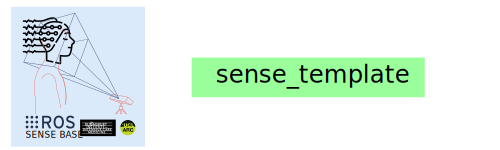

<div style="text-align: center;" align="center">
  
  <h1> sense_template </h1>
</div>

## :eyeglasses: Overview
This repository contains a template for ROS2 packages with [humble distribution](https://docs.ros.org/en/rolling/Releases.html#list-of-distributions) of the SENSE-BASE organisation.


## :school_satchel: Getting started
Please see the [README](https://github.com/sense-base/.github/blob/main/profile/README.md) for details on how to install the required packages and dependencies for ROS2 (such as docker), set up a virtual environment, run and debug the code, and read the contribution guidelines and code of conduct.

## :octocat: Cloning repository and contribute to it
* Generate your SSH keys as suggested [here](https://docs.github.com/en/github/authenticating-to-github/generating-a-new-ssh-key-and-adding-it-to-the-ssh-agent)
* Setup you commit signature verification as shown [here](https://docs.github.com/en/authentication/managing-commit-signature-verification/about-commit-signature-verification#ssh-commit-signature-verification)
* Clone the repository by typing (or copying) the following lines in a terminal
```
git clone git@github.com:sense-base/sense_template.git
```

## :nut_and_bolt: Create package from scratch
```
ros2 pkg create sense_template --build-type ament_python # For python packages
ros2 pkg create sense_template --build-type ament_cmake # For C/C++ packages
```
* NOTES.
  * Pure Python packages should use the ament_python build type in most cases. 
  * To create an ament_python package, see [Creating your first ROS 2 package](https://docs.ros.org/en/humble/How-To-Guides/Ament-CMake-Python-Documentation.html#ament-cmake-python-user-documentation): ament_cmake_python should only be used in cases where that is not possible, like when mixing C/C++ and Python code.
  * [Create a ROS2 package for Both Python and Cpp Nodes](https://roboticsbackend.com/ros2-package-for-both-python-and-cpp-nodes)

## :computer: Local development with pre-commit
See [here](https://github.com/sense-base/.github/tree/main/profile#using-uv) to install uv virtual environment.
```
uv run pre-commit run -a
```

