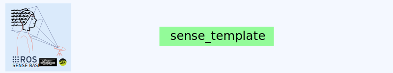

<div style="text-align: center;" align="center">
  
  <h1> sense_template </h1>
</div>

## :eyeglasses: Overview
This repository contains a template for packages of the SENSE-BASE organisation.


## :school_satchel: Getting started
Please see the [README](https://github.com/sense-base/.github/blob/main/profile/README.md) for details on how to install the required packages and dependencies, set up a virtual environment, run and debug the code, and read the contribution guidelines and code of conduct.

## :octocat: Cloning repository and contribute to it
* Generate your SSH keys as suggested [here](https://docs.github.com/en/github/authenticating-to-github/generating-a-new-ssh-key-and-adding-it-to-the-ssh-agent)
* Setup you commit signature verification as shown [here](https://docs.github.com/en/authentication/managing-commit-signature-verification/about-commit-signature-verification#ssh-commit-signature-verification)
* Clone the repository by typing (or copying) the following lines in a terminal
```
git clone git@github.com:sense-base/sense_template.git
```

